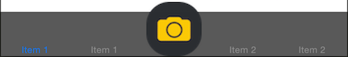

# SwiftRaisedTab

Based on this blog post:   
[http://idevrecipes.com/2010/12/16/raised-center-tab-bar-button](http://idevrecipes.com/2010/12/16/raised-center-tab-bar-button)



## Installation

Install CocoaPods using the following command.

```bash
$ gem install cocoapods
```

Add the following to your Podfile.

```ruby
source 'https://github.com/CocoaPods/Specs.git'
platform :ios, '8.0'
use_frameworks!

pod 'SwiftRaisedTab', '~> 0.2.0'
```

## Usage

Subclass RaisedTabBarController and implement the following in `viewWillAppear` and `onRaisedButton`.

> To link to storyboard, drag a new TabBarController into the storyboard and change Custom Class to your RaisedTabBarController subclass.

```swift
import UIKit
import SwiftRaisedTab

class ViewController: RaisedTabBarController {

    override func viewDidLoad() {
        super.viewDidLoad()
        // Do any additional setup after loading the view, typically from a nib.
    }

    override func didReceiveMemoryWarning() {
        super.didReceiveMemoryWarning()
        // Dispose of any resources that can be recreated.
    }
    
    override func viewWillAppear(animated: Bool) {
        super.viewWillAppear(animated)
        
        // Insert empty tab item at center index. In this case we have 5 tabs.
        self.insertEmptyTabItem("", atIndex: 2)
        
        // Raise the center button with image
        let img = UIImage(named: "icon_camera")
        self.addRaisedButton(img, highlightImage: nil)
    }
    
    // Handler for raised button
    override func onRaisedButton(sender: UIButton!) {
    	super.onRaisedButton(sender)

        println("Raised button tapped")
    }

}
```